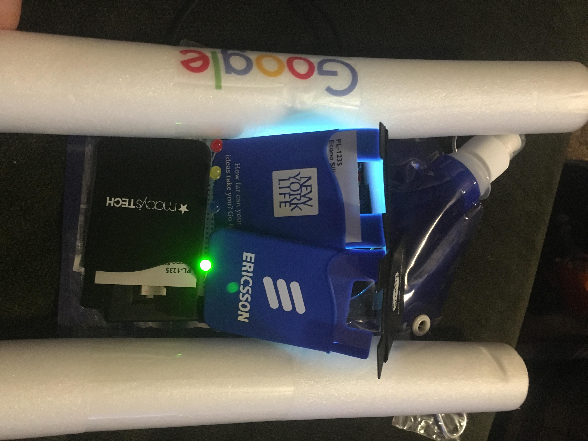
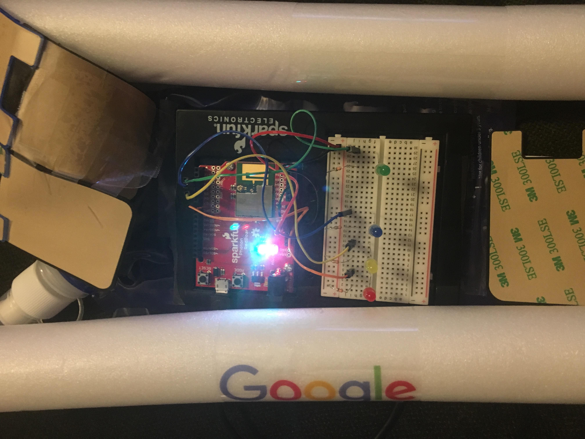
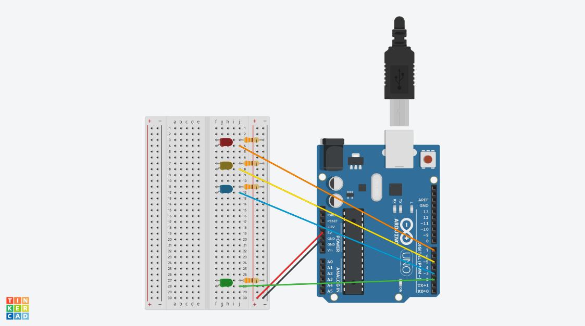

# Midterm IoT Project

Name:  Kate O'Hanlon

Due Date: 10/12/2017

## Project: Canary Miner

### Conceptual Description

/// Replace with a description of the ***critical / conceptual dimensions of your project***, with specific reference to the key issues it engages.  These should intersect with the issues that have been explored in the readings and discussions during the first half of class:  eWaste, data security/ownership in relation to corporate cloud infrastructures; critical making; surveillance and privacy, etc. ** *How does your project engage with these issues beyond mere instrumentality?* ** ///

This project focuses on data ownership and surveillance. So much of what we do online using "free" services is actually at the expense of our privacy. To this end, Canary Miner is designed to track Twitter usage as an advertiser would. It triggers an LED when a post is made that might mean the person is anticipating a major life event that could be very profitable to advertisers, such as a baby, wedding, or move. (See [this article](http://www.businessinsider.com/the-incredible-story-of-how-target-exposed-a-teen-girls-pregnancy-2012-2), or [this one](http://www.dailymail.co.uk/news/article-2102859/How-Target-knows-shoppers-pregnant--figured-teen-father-did.html) if you want more details, for an idea of just how much companies can learn from relatively little data!) Every time one of the three main LEDs lights up, anyone with access to your posts could be mining data related to one of these three events. 

### Form

/// Your project should be embodied in a ***physical form*** that reflects, embodies, and/or amplifies those your project's main concepts and ideas.
Explain your design choices here and include images that document your project's material embodiment. ///

The physical form furthers the imagery, as this data gathering is largely hidden behind walls of exciting products to distract you from the privacy cost. We are so interested in the fun, useful, carefully-designed aspects of the interfaces that we don't always notice what's happening in the background, hidden beneath that shiny interface. In addition, it hints at the issue of e-waste; though mostly plastic, each item in the case represents a company with huge numbers of servers, sensors, employee computers, and more. 

**Finished Enclosure:**



**Electronics Exposed:**



### Technical Details

The hardware involved is relatively simple; beyond the breadboard and Photon, it's just 4 LEDs (one in each color provided), 4 capacitors, and the wires required to link everything. The wiring diagram below shows how they are connected. 

It uses IFTTT to publish updates when there is a new tweet to the account I set up. There are five pub/sub events total. The red, yellow, and blue lights are triggered for tweets related to moving, pregancy, and engagements respectively, and all pubs come from IFTTT. The green light responds to both a heartbeat pulse sent from Matt every 30 seconds and notifications from IFTTT indicating that a new tweet was published to the account regardless of content. The latter results in a published event, which not only turns on the green LED as mentioned but also gets sent to Matt: 
```
void tellMatt(const char *event, const char *data){
    Particle.publish("lost_my_partner", "A tweet was published");
}
```


A large portion of the code is dedicated to turning the LEDs back off. Since setting a delay would make it impossible for multiple lights to be on at once, which would be unhelpful in many ways, I created counters to function as timers. Every time an event is triggered, it resets the counter for that respective LED and turns it on. When the counter reaches a preset maximum, it turns off the corresponding LED and resets its counter (since turning the LED off repeatedly is less efficient than simply resetting the counter and there is no detriment to the reset). 

Here is the full code: [photon.ino](photon.ino)

**Wiring Diagram**


